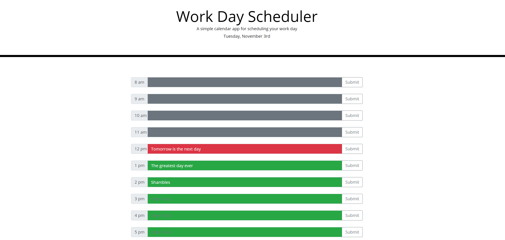
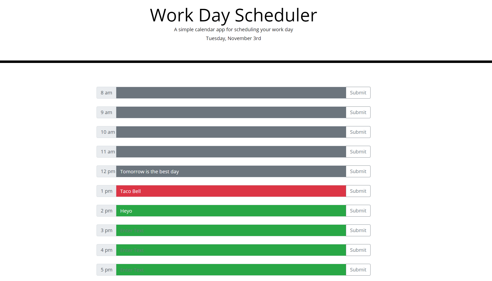
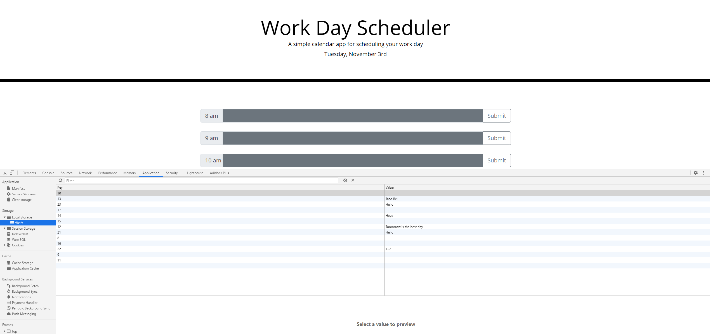

# Work Day Scheduler

Work Day Scheduler by using Third Party Manipulation 

## Assignment

Goal is to create a work day scheduler by using thrid party manipulation such as a timer.
* When opening the planner the day and month must be shown on the page.
* Time blocks must be presented
  * Each time block must be color coded from the past, now, and future. 
  * Also should allow the user to input their own plans in the time blocks.
* When the time blocks have been inputed, empty or not. It will save the planner even if the user refreshes the page

## How it Works

Starting up the page the user will see a workday scheduler along with the current month and day displayed below the title screen.
Looking at the time blocks the user will see different colors displaying on each time. Gray Represents the time before your current time, Red is the current time, Green is the
future times.
Note: You can input your schedule in Red and Green, however you cannot input anything in the gray.

If you compare from the first image to this, you can see that the time is able to pass through hourly.

If the user submits their inputs, whether it is entered or not. The data will be stored even when the user refreshes the page. The image shows the data being stored. 

